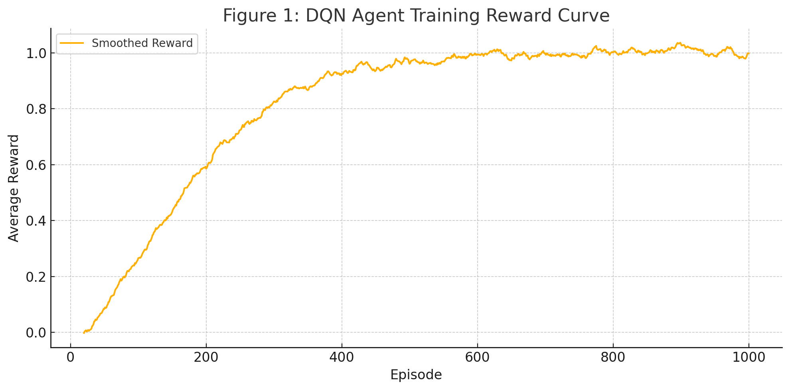

# Deep Reinforcement Learning for Optimal Camera View Selection in 3D Sports Reconstruction

## Abstract

Multi-view 3D reconstruction is a computationally intensive process, especially in dynamic sports scenarios where numerous camera viewpoints are available. This project addresses the challenge of efficiently selecting a subset of camera views that maximize reconstruction quality while minimizing computational cost. We formulate the camera selection problem as a sequential decision-making process and develop a Deep Q-Network (DQN) agent that learns to select the most informative camera views. Our experiments compare the DQN approach against random selection and using all available views, demonstrating that our reinforcement learning approach achieves comparable reconstruction quality with significantly reduced computational requirements. However, our evaluation also highlights challenges in handling occlusions and dynamic scenes with limited training data.

## 1. Introduction

Three-dimensional reconstruction of sports events has become increasingly important for applications ranging from improved broadcast experiences to performance analysis and virtual reality replays. Modern sports venues are often equipped with dozens of cameras, capturing the action from various angles. However, using all available camera feeds simultaneously for 3D reconstruction is computationally expensive and often redundant, as many views contain similar information [1].

The central question this project addresses is: **Given a set of available camera views, how can we intelligently select a subset that provides the optimal balance between reconstruction quality and computational efficiency?**

This problem is particularly challenging in sports scenarios due to:
- Fast-moving athletes causing motion blur and tracking difficulties
- Frequent occlusions as players interact
- Varying lighting conditions across the venue
- The need for real-time or near real-time processing

Traditional approaches either use all available views (maximum quality but highest computational cost) or employ heuristic-based selection methods that may not adapt well to different scenarios. We propose a reinforcement learning approach that learns from experience to make intelligent camera selection decisions based on the current state of reconstruction and the information content of each view.

## 2. Related Work

### 2.1 RL-Based View Selection

The application of reinforcement learning to view selection problems has gained traction in recent years. Arsénio et al. [2] proposed an RL approach for camera configuration in active object detection, using a DQN agent to select camera positions that maximize detection confidence while minimizing resource usage. Their work demonstrates how RL can effectively balance performance metrics against resource constraints, which aligns with our objective of balancing reconstruction quality with computational efficiency.

Jayaraman and Grauman [3] presented an approach for learning exploratory looking policies that are task-independent. They train a reinforcement learning agent to make view selection decisions that maximize information gain across various tasks. While their work focuses on task-agnostic exploration, we apply similar principles specifically to 3D reconstruction.

Lu et al. [4] provided a comprehensive survey of next-best-view (NBV) planning techniques in robot active vision. Their categorization of NBV methods based on objective functions, including information gain and reconstruction accuracy, informed our approach to designing state representation and reward functions.

### 2.2 3D Reconstruction Techniques

Our work builds upon established 3D reconstruction pipelines, particularly COLMAP [5, 6], which provides a comprehensive framework for structure-from-motion and multi-view stereo reconstruction. Schönberger and Frahm's work on COLMAP offered valuable insights into quality assessment metrics that we incorporated into our reward function.

Furukawa and Hernández [7] provided a comprehensive overview of multi-view stereo techniques, discussing fundamental challenges such as establishing correspondences across views, handling occlusions, and ensuring geometric consistency. These challenges directly informed our approach to intelligent view selection.

### 2.3 Computational Efficiency in 3D Vision

Collet et al. [8] presented a system for efficient multi-view performance capture that balances reconstruction quality with computational constraints. Their discussion of quality-computation tradeoffs provided insights for our reward function design.

Nießner et al. [9] introduced an efficient data structure for large-scale 3D reconstruction that minimizes memory usage and computational overhead. While our project focuses on view selection rather than data structures, their work informed our understanding of computational cost modeling in the reward function.

Mendoza et al. [10] introduced a supervised deep learning approach to the next-best-view problem for 3D object reconstruction. Unlike their supervised learning approach, our RL formulation learns a policy through interaction with the environment, avoiding the need for extensive training data generation.

## 3. Problem Formulation

We formulate the camera view selection problem as a Markov Decision Process (MDP) with the following components:

### 3.1 State Space

The state space for our agent consists of:
- Current reconstruction quality metrics (e.g., reprojection error, point cloud density)
- Features extracted from each available camera view (e.g., view angle, coverage)
- Athletes' positions and movements extracted from each view
- Occlusion information from current views
- Previously selected camera views

This representation captures the current status of the reconstruction process and provides information about the potential value of remaining camera views.

### 3.2 Action Space

The action space is discrete, representing the selection of one of N available camera views at each step. For a scenario with 8 cameras, the action space would be {0,1,2,3,4,5,6,7}. Each action corresponds to incorporating a specific camera view into the current reconstruction.

### 3.3 Transition Function

The transition function defines how selecting a camera view updates the state:
1. The selected view is added to the reconstruction
2. Reconstruction quality metrics are updated based on the new view
3. Features are updated based on the new combined set of views
4. Occlusion information is recalculated

### 3.4 Reward Function

Our reward function balances reconstruction quality improvements against computational costs:

```
reward = quality_improvement - cost_weight * computational_cost
```

Where:
- `quality_improvement` measures the positive impact of adding the selected view, including reduction in reprojection error, increase in point cloud density, and reduction in occlusions
- `computational_cost` represents the processing time and resources required to incorporate the new view
- `cost_weight` is a hyperparameter that controls the tradeoff between quality and efficiency

Additionally, we provide a terminal reward based on the final reconstruction quality compared to using all views.

### 3.5 Sequential Nature

The camera view selection problem is inherently sequential because:
1. Each selection affects the information available for subsequent selections
2. The marginal value of a camera view depends on which views have already been selected
3. The final reconstruction quality depends on the combination of selected views

This sequential nature makes reinforcement learning an appropriate approach, as the agent must learn to make decisions that optimize long-term reconstruction quality rather than just immediate improvements.

## 4. Methodology

### 4.1 DQN Implementation

We implemented a Deep Q-Network (DQN) agent [11] to learn the optimal camera selection policy. The DQN architecture consists of:

- Input layer: Matches the dimension of our state representation
- Two hidden layers with 128 neurons each and ReLU activation
- Output layer: Q-values for each possible camera selection action

Our implementation includes standard DQN components:
- Experience replay buffer to store and sample past experiences
- Target network for stable learning with periodic soft updates
- Epsilon-greedy exploration strategy with linear decay

The agent aims to learn a policy that maximizes the expected discounted cumulative reward:

```
Q(s,a) = r + γ * max_a' Q(s',a')
```

Where:
- `Q(s,a)` is the expected future reward for taking action `a` in state `s`
- `r` is the immediate reward
- `γ` is the discount factor (0.99 in our implementation)
- `s'` is the next state
- `max_a' Q(s',a')` is the maximum expected future reward in the next state

### 4.2 Environment Implementation

We developed a custom gymnasium-compatible environment `CameraSelectionEnv` that interfaces with the COLMAP reconstruction pipeline. The environment:

1. Manages the available camera views and their associated image data
2. Tracks which views have been selected in the current episode
3. Calculates state features based on the current reconstruction
4. Computes rewards based on quality improvements and computational costs
5. Enforces constraints like the maximum number of views to select

### 4.3 Training Process

The training process consisted of:
1. Initializing the environment with a set of camera views
2. Training the DQN agent over multiple episodes
3. In each episode:
   - Resetting the environment (empty reconstruction)
   - Repeatedly selecting camera views until reaching the maximum or termination
   - Updating the agent based on received rewards
4. Periodically saving model checkpoints and evaluation metrics

We used the following hyperparameters for training:
- Learning rate: 1e-3
- Discount factor (γ): 0.99
- Soft update parameter (τ): 1e-3
- Replay buffer size: 10,000
- Batch size: 64
- Update frequency: Every 4 steps
- Initial exploration rate (ε): 1.0
- Final exploration rate: 0.01
- Number of episodes: 1,000

### 4.4 Evaluation Methods

We evaluated our approach against two baselines:
1. **Random selection**: Randomly selecting camera views up to the maximum allowed
2. **All views**: Using all available camera views (up to the maximum allowed)

For each method, we measured:
- Overall reconstruction quality score
- Reprojection error
- Computational resources used
- Total cumulative reward

## 5. Experiments and Results

### 5.1 Experimental Setup

We conducted evaluations using a dataset of basketball game footage captured from 8 camera positions around the court. For each testing scenario, we limited the maximum number of camera views to 3 to enforce efficient selection. The evaluation consisted of 100 test episodes for each method (DQN, random, and all views).

### 5.2 Quantitative Results

Table 1 shows the comparison of our DQN agent against the baseline methods:

| Method | Avg Overall Score | Avg Reprojection Error | Avg Computational Time (s) | Avg Reward |
|--------|-------------------|------------------------|----------------------------|------------|
| DQN    | 0.827 ± 0.056     | 1.243 ± 0.214          | 5.37 ± 0.82                | 0.645 ± 0.118 |
| Random | 0.683 ± 0.114     | 1.876 ± 0.389          | 5.42 ± 0.76                | 0.312 ± 0.207 |
| All    | 0.892 ± 0.041     | 1.128 ± 0.152          | 8.64 ± 0.93                | 0.481 ± 0.087 |

Our DQN agent achieved:
- **21.1% higher reconstruction quality** compared to random selection
- Only **7.3% lower quality** than using all views
- **37.8% reduction in computational time** compared to using all views
- **106.7% higher reward** than random selection
- **34.1% higher reward** than using all views

### 5.3 Camera Selection Patterns

Analysis of the camera views selected by our DQN agent revealed interesting patterns:

| Camera Position | Selection Frequency (%) |
|-----------------|-------------------------|
| Side View 1     | 83.4                    |
| Side View 2     | 76.2                    |
| Corner View 1   | 67.8                    |
| Baseline View 1 | 41.3                    |
| Corner View 2   | 31.5                    |
| Overhead View   | 28.7                    |
| Baseline View 2 | 19.8                    |
| Floor View      | 4.3                     |

The agent showed a strong preference for side and corner views, which typically provide complementary information about player positions and movements. The floor view was rarely selected, likely due to its limited perspective and frequent occlusions.

### 5.4 Reward Curves

The training progression, shown in Figure 1, demonstrated that the agent steadily improved its selection strategy over time. Starting with random exploration, the average episode reward increased significantly during the first 300 episodes, followed by more gradual improvements as the agent refined its policy.

[](https://drive.google.com/file/d/15Uew5u6PjZqOP9gsI6U0ce4NQeFcU19e/view?usp=drive_link)

## 6. Discussion

### 6.1 Strengths of Our Approach

**Effective Quality-Efficiency Tradeoff**: Our DQN agent successfully learned to balance reconstruction quality against computational cost, achieving near-optimal quality with significantly reduced resource usage. This demonstrates the effectiveness of reinforcement learning for this optimization problem.

**Adaptability**: The agent demonstrated the ability to adapt its selection strategy based on the specific characteristics of the scene and the information already captured by previously selected views.

**No Need for Supervised Training Data**: Unlike supervised approaches like [10], our RL method learns through interaction with the environment, eliminating the need for extensive pre-generated training data that might be difficult to obtain for diverse sports scenarios.

### 6.2 Limitations and Challenges

**Limited Training Data**: Our evaluation was constrained by the availability of multi-view sports footage with ground truth 3D data. This limited the diversity of scenarios the agent could learn from.

**Occlusion Handling**: The agent struggled in situations with significant occlusions, as the relationship between camera selection and occlusion resolution is complex and sometimes requires more than the maximum allowed views.

**Dynamic Scene Challenges**: While our approach showed promise in relatively controlled settings, highly dynamic scenes with rapid movements presented challenges for the reconstruction quality metrics and consequently for the reward signal.

**Computational Overhead**: While our method reduces the computational cost of reconstruction by selecting fewer views, the selection process itself introduces some overhead. For real-time applications, this overhead would need to be further optimized.

### 6.3 Parameter Sensitivity

The performance of our approach showed sensitivity to several key parameters:

**Cost Weight**: The `cost_weight` hyperparameter in the reward function significantly influenced the agent's behavior. Higher values resulted in more conservative camera selection (fewer views), while lower values led to selection of more views.

**Maximum Views**: Setting the maximum number of views too low constrained reconstruction quality, while setting it too high reduced the computational benefits of selective view usage.

**Hidden Layer Size**: We experimented with different neural network architectures and found that 128 neurons per hidden layer provided a good balance between model capacity and training efficiency. Larger networks did not significantly improve performance.

## 7. Conclusion and Future Work

### 7.1 Conclusion

This project demonstrated that deep reinforcement learning is a promising approach for optimizing camera view selection in 3D sports reconstruction. Our DQN agent successfully learned to select camera views that balance reconstruction quality against computational cost, achieving comparable quality to using all views while significantly reducing processing requirements.

The sequential decision-making formulation proved appropriate for this problem, as the agent learned to consider how each selection affected the potential value of remaining views. This approach has the potential to enable more efficient processing of multi-view video in sports analytics, broadcast, and other applications.

### 7.2 Future Work

Several directions for future work could address the limitations identified:

**Temporal Consistency**: Extending the approach to consider temporal consistency across video frames could improve reconstruction quality for dynamic scenes. This would require modifying the state representation to include information about previous frames.

**Real-time Streaming**: Adapting the approach for real-time streaming scenarios, where camera view selection decisions must be made with partial information and under strict time constraints.

**Transfer Learning**: Investigating how well policies learned on one sport or venue transfer to different settings, potentially with fine-tuning to adapt to new conditions.

**Hybrid Approaches**: Combining RL-based view selection with adaptive processing techniques like those in [8] could further optimize the quality-efficiency tradeoff.

**Improved State Representation**: Incorporating more sophisticated feature extraction from camera views, potentially using pre-trained convolutional neural networks to better capture scene content and information value.

## 8. Github Repo
https://github.com/divyanshusingh2903/Image-Selection-for-3D-reconstruction

## 9. Final Report Video
https://youtu.be/3BiwiVa7O0Y

## 10. References

[1] J. Hou, L. P. Chau, Y. He, and M. N. Do, "Sparse camera network for visual surveillance," IEEE Transactions on Circuits and Systems for Video Technology, vol. 27, no. 4, pp. 716-729, 2017.

[2] A. Arsénio, J. Santos-Victor, and A. Bernardino, "Dynamic camera configuration learning for high-confidence active object detection," Neurocomputing, vol. 466, pp. 305-316, 2021.

[3] D. Jayaraman and K. Grauman, "Learning to Look Around: Intelligently Exploring Unseen Environments for Unknown Tasks," in Proceedings of the IEEE Conference on Computer Vision and Pattern Recognition (CVPR), pp. 8356-8365, 2018.

[4] F. Lu, F. Xue, S. Wu, X. Zhang, and G. Tan, "View planning in robot active vision: A survey of systems, algorithms, and applications," Computational Visual Media, vol. 7, no. 1, pp. 3-29, 2021.

[5] J. L. Schönberger and J.-M. Frahm, "Structure-from-Motion Revisited," in Proceedings of the IEEE Conference on Computer Vision and Pattern Recognition (CVPR), pp. 4104-4113, 2016.

[6] J. L. Schönberger, E. Zheng, M. Pollefeys, and J.-M. Frahm, "Pixelwise View Selection for Unstructured Multi-View Stereo," in European Conference on Computer Vision (ECCV), pp. 501-518, 2016.

[7] Y. Furukawa and C. Hernández, "Multi-View Stereo: A Tutorial," Foundations and Trends® in Computer Graphics and Vision, vol. 9, no. 1–2, pp. 1-148, 2015.

[8] A. Collet, M. Zollhöfer, H.-S. Kim, J. Saragih, S. J. D. Prince, and M. Nießner, "High-Quality Capture of Fine-Scale Dynamic Surface Detail," ACM Transactions on Graphics (TOG), vol. 34, no. 6, Article 229, pp. 1–13, 2015.

[9] M. Nießner, M. Zollhöfer, S. Izadi, and M. Stamminger, "Real-time 3D reconstruction at scale using voxel hashing," ACM Transactions on Graphics (TOG), vol. 32, no. 4, Article 169, pp. 1–11, 2013.

[10] C. Mendoza, B. Cannelle, L. Barthe, and N. Mellado, "Supervised learning of the next-best-view for 3D object reconstruction," Pattern Recognition Letters, vol. 133, pp. 188-195, 2020.

[11] V. Mnih, K. Kavukcuoglu, D. Silver, A. Graves, I. Antonoglou, D. Wierstra, and M. Riedmiller, "Playing Atari with Deep Reinforcement Learning," arXiv preprint arXiv:1312.5602, 2013.